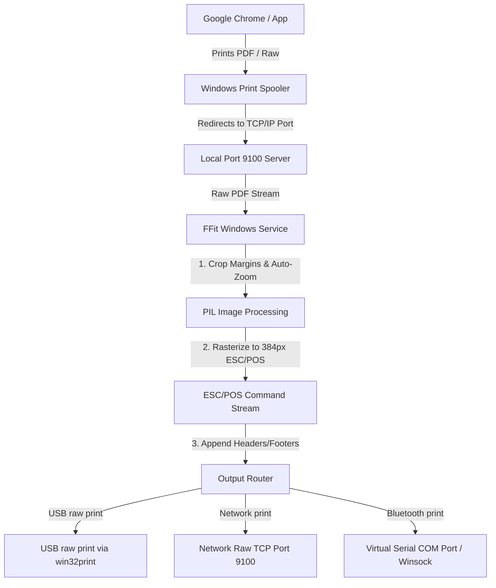

# FFit Thermal Printer Driver — Windows Implementation Plan

This document outlines the architecture, design choices, and implementation steps required to port the **FFit Thermal Printer Driver** from Ubuntu Linux to **Windows (10/11)**.

---

## 📐 Architecture Design (Windows vs. Linux)

In Linux, we used the CUPS system backend and a custom PPD file. In Windows, we can achieve an even cleaner, driverless setup by implementing a **Local TCP/IP Port Monitor Service** or a **Local Port 9100 Print Server**.

### 1. Local Port 9100 Print Server (Recommended)
* **How it works**: A lightweight Python background service runs on `127.0.0.1:9100`.
* **Spooler Setup**: The user adds a standard Windows printer selecting:
  - Port: **Standard TCP/IP Port** (`127.0.0.1`, Port `9100`)
  - Driver: **Generic / Text Only** or **Zijiang ZJ-58** (to output clean raw streams/PDF vectors).
* **Benefits**: No complex Windows kernel-level driver development required. Chrome and system apps detect the printer natively.

### 2. Output Interfaces on Windows
* **USB**: Windows does not expose USB printers as simple file nodes (like `/dev/usb/lp0`). Instead, we write to the printer handle using the native **Win32 Spooler API** (`win32print.OpenPrinter`, `win32print.StartDocPrinter`, `win32print.WritePrinter`).
* **Bluetooth**: Windows maps paired Bluetooth SPP (Serial Port Profile) devices to virtual COM ports (e.g., `COM3`, `COM4`). We stream data using python's `pyserial` library.
* **Network**: Standard TCP sockets connection to Port `9100`.

---

## 📋 Implementation Steps

### Step 1: Python Spooler Service (`ffit_service.py`)
* Create a multi-threaded TCP server listening on port `9100`.
* Capture print jobs sent from Chrome.
* Check file signature:
  - If PDF: Extract vector pages, crop horizontal margins, scale to 384px, and convert to ESC/POS raster commands.
  - If Raw: Stream directly to the output.
* Append the brand footer: `Powered by- FFIT.IO`.

### Step 2: Win32 API Integration (`win32_usb.py`)
* Use `pywin32` library to find USB printer devices by name (e.g. `ZJ-58`).
* Stream raw ESC/POS bytes directly to the printer spooler without print dialogue intervention.

### Step 3: Flutter App Adaptation (`ffit_printer_windows`)
* Adapt settings paths: Save printer configurations to `%APPDATA%/ffit/config.json`.
* UI Reusability: Re-use the existing glassmorphic theme, desktop launcher, and status indicators.
* Adapt Discovery Service:
  - USB: List active Windows printers using `win32print.EnumPrinters`.
  - Bluetooth: Scan virtual COM ports using `pyserial`.
  - Network: Ping network subnet IPs.

---

## ⚡ Key Considerations to Avoid Duplicate Issues

1. **CUPS Caching Equivalent**: Windows Spooler caches print configurations. When modifying the Port 9100 target, ensure the spooler service is restarted or the printer queue is cleared.
2. **Horizontal Margin Cropping**: Chrome default layouts add wide white margins on Windows. We must apply the same standard deviation pixel column cropping algorithm to maintain font sizes on 58mm paper.
